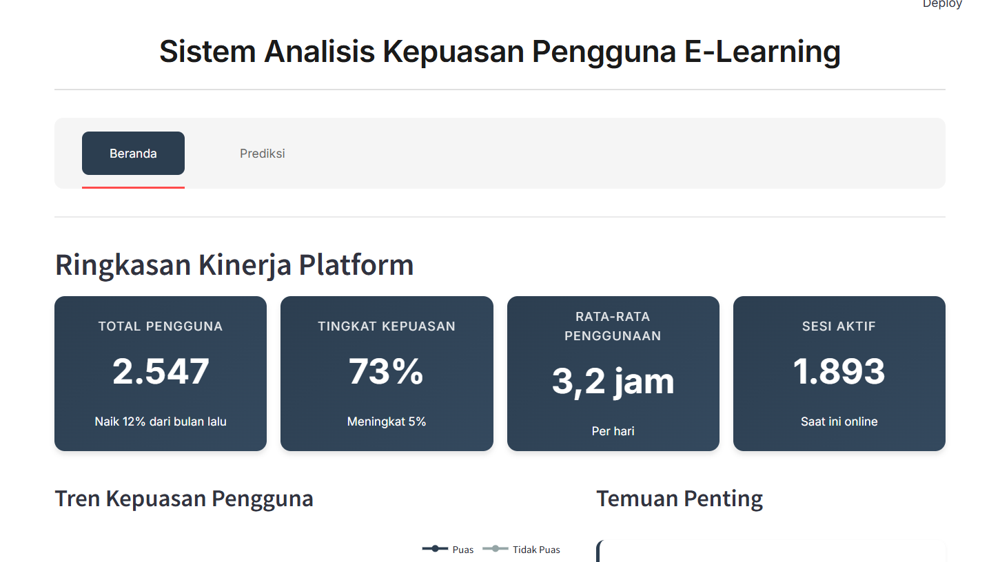
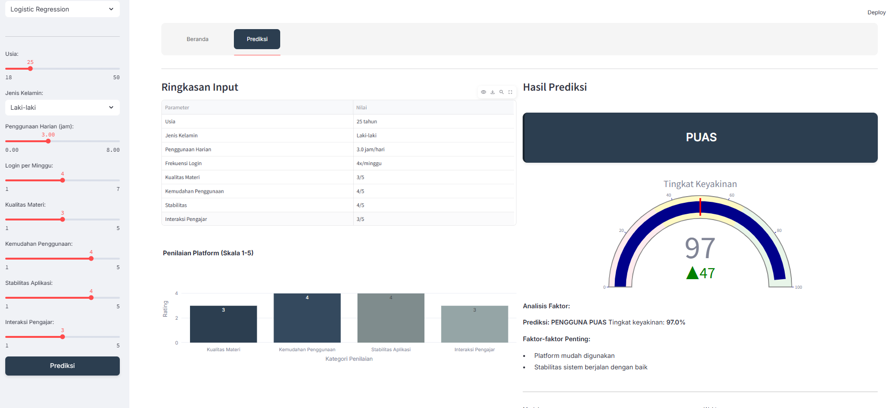

# Sistem Prediksi Kepuasan Pengguna E-Learning

Aplikasi web interaktif untuk menganalisis dan memprediksi tingkat kepuasan pengguna platform e-learning menggunakan algoritma machine learning. Sistem ini dirancang untuk membantu pengelola platform dalam memahami faktor-faktor yang mempengaruhi kepuasan pengguna dan membuat keputusan berbasis data.

## Demo Aplikasi

### Halaman Beranda


Halaman beranda menampilkan ringkasan kinerja platform secara keseluruhan, termasuk:
- Statistik utama (total pengguna, tingkat kepuasan, penggunaan harian)
- Tren kepuasan pengguna dalam 6 bulan terakhir
- Breakdown penilaian platform berdasarkan kategori
- Insight dan rekomendasi berdasarkan data

### Halaman Prediksi


Halaman prediksi memungkinkan pengguna untuk:
- Input data pengguna melalui form interaktif
- Memilih model machine learning (Logistic Regression atau Decision Tree)
- Melihat hasil prediksi beserta tingkat keyakinannya
- Mendapatkan analisis faktor-faktor yang mempengaruhi prediksi

## Latar Belakang

Platform e-learning semakin populer sebagai media pembelajaran jarak jauh. Namun, tingkat kepuasan pengguna sangat bervariasi dan dipengaruhi oleh berbagai faktor. Sistem ini dikembangkan untuk:

1. Mengidentifikasi pola yang mempengaruhi kepuasan pengguna
2. Memprediksi kepuasan pengguna berdasarkan profil dan perilaku mereka
3. Memberikan insight untuk perbaikan platform

## Fitur Utama

### Dashboard Analytics
- Visualisasi tren kepuasan pengguna
- Statistik kinerja platform real-time
- Distribusi pengguna berdasarkan demografi dan perilaku
- Rekomendasi berbasis data untuk perbaikan platform

### Sistem Prediksi
- Dua model machine learning (Logistic Regression dan Decision Tree)
- Interface input yang sederhana dan intuitif
- Hasil prediksi dengan tingkat keyakinan
- Analisis faktor-faktor yang mempengaruhi hasil prediksi

### Teknologi
- **Frontend**: Streamlit dengan custom CSS
- **Backend**: Python, scikit-learn
- **Visualisasi**: Plotly
- **Data Processing**: Pandas, NumPy

## Parameter Input

Sistem menerima 8 parameter untuk melakukan prediksi:

| Parameter | Rentang | Deskripsi |
|-----------|---------|-----------|
| Usia | 18-50 tahun | Usia pengguna platform |
| Jenis Kelamin | L/P | Laki-laki atau Perempuan |
| Durasi Penggunaan | 0-8 jam/hari | Rata-rata waktu yang dihabiskan di platform |
| Frekuensi Login | 1-7 kali/minggu | Seberapa sering pengguna mengakses platform |
| Kualitas Materi | 1-5 | Penilaian terhadap konten pembelajaran |
| Kemudahan Penggunaan | 1-5 | Penilaian terhadap user interface |
| Stabilitas Aplikasi | 1-5 | Penilaian terhadap performa teknis |
| Interaksi Pengajar | 1-5 | Penilaian terhadap responsivitas pengajar |

## Instalasi

### Prasyarat
- Python 3.8 atau lebih baru
- pip (Python package manager)

### Langkah Instalasi

1. Clone repository ini
```bash
git clone <repository-url>
cd elearning-satisfaction-prediction
```

2. Install dependencies
```bash
pip install -r requirements.txt
```

3. Generate dataset (untuk testing)
```bash
python generate_dummy_data.py
```

4. Training model
```bash
python train_model.py
```

5. Jalankan aplikasi
```bash
streamlit run app.py
```

Aplikasi akan terbuka di browser pada alamat `http://localhost:8501`

## Cara Penggunaan

### Melihat Dashboard Analytics
1. Buka aplikasi di browser
2. Klik tab "Beranda" 
3. Lihat berbagai visualisasi dan insight yang tersedia

### Melakukan Prediksi
1. Klik tab "Prediksi"
2. Pilih model yang ingin digunakan
3. Atur parameter di sidebar sesuai data pengguna
4. Klik tombol "Prediksi"
5. Lihat hasil prediksi dan analisisnya

## Model Machine Learning

### Logistic Regression
Model statistik yang menggunakan fungsi logistik untuk memodelkan probabilitas kelas. Cocok untuk memahami hubungan linear antar fitur dan hasil prediksi.

### Decision Tree
Model berbasis pohon keputusan yang membagi data berdasarkan aturan if-then. Mampu menangkap pola non-linear dalam data.

## Struktur Project

```
elearning-satisfaction-prediction/
│
├── app.py                                      # Aplikasi utama
├── train_model.py                              # Script training model
├── generate_dummy_data.py                      # Generator dataset dummy
├── requirements.txt                            # Dependencies
├── README.md                                   # Dokumentasi
│
├── dataset_kepuasan_pengguna_elearning.csv    # Dataset (generated)
│
└── Model files (generated setelah training):
    ├── logreg_model.pkl
    ├── dt_model.pkl
    ├── scaler.pkl
    └── label_encoder.pkl
```

